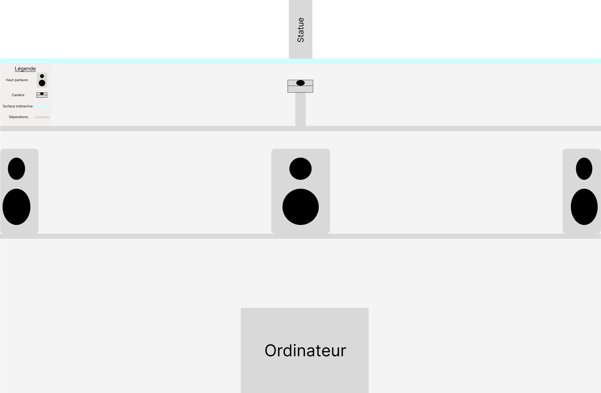
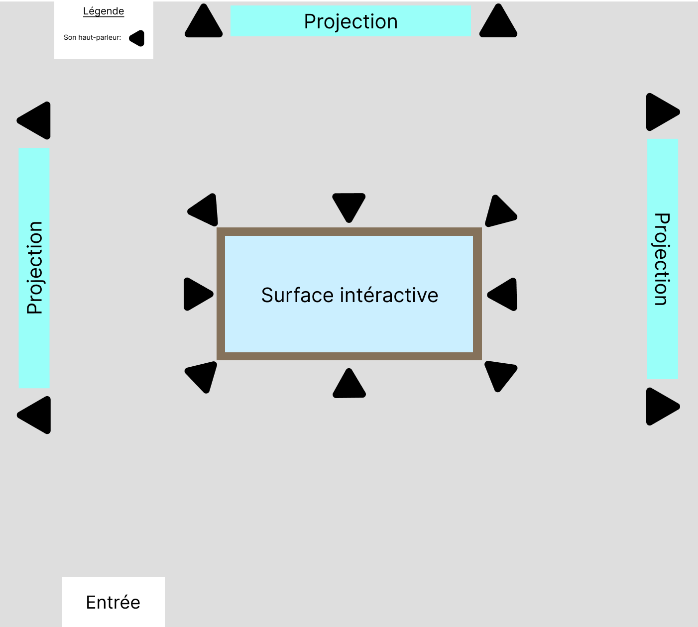
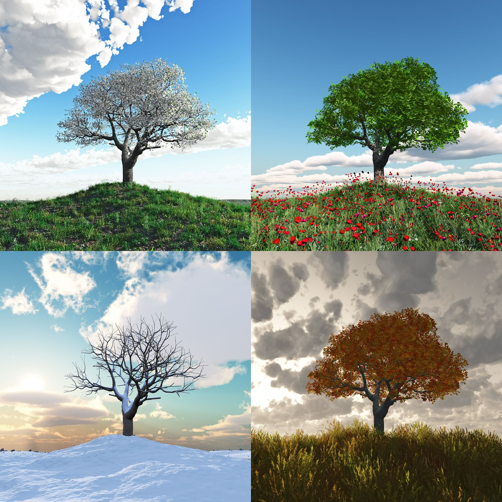
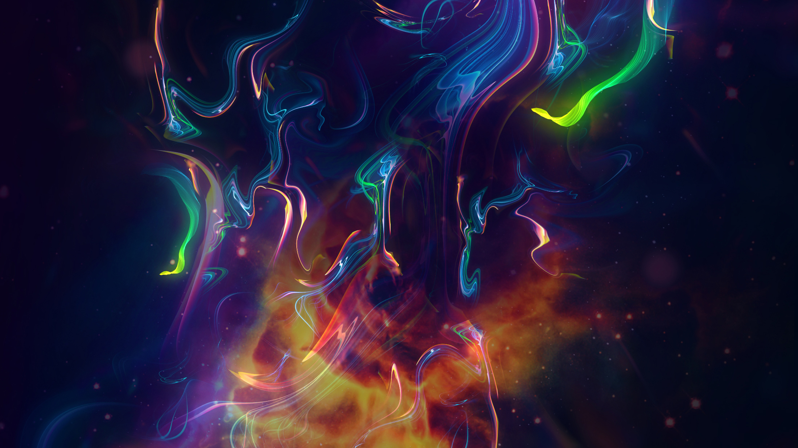

# Projet_table_interactive

## Concept général
Notre projet est une table intéractive qui a comme thème les 4 saisons. Lorsque nous placerions une statuette sur la table un son serait activer en lien avec la saison choisi. Ce son jourais plus proche de l'endroit ou il à été placer.

### Thème
4 saisons/nature
### Espace

## Inspirations 
### Conceptuelles

L'inspiration conceptuelle serait en lien avec les 4 saisons et ces différents climats.
### Artistique/Esthétique

Pour l'esthétique les projections afficherait des lignes de différentes couleurs qui pourrait se jumeler si l'ont place plusieurs statuettes en même temps. Les couleurs et la formes de ces lignes serait déterminé par la saison et leur vitesse aussi.
### Technique/Technologique

Pour la technologie utiliser, nous utiliserions spat pour le son, max pour la vidéo et une caméra pour détecter les statuettes.

## Concept spécifique
Une fois la statuette placer, les trois projecteurs afficheraient des lignes de couleurs qui agirait de façon différente dépendamment de la statuette. Les projections auraient chacune deux haut-parleurs chacune et diffuserait des drones en lien avec ce qui est afficher. Nous pourrions placer deux statuettes à la fois pous mélanger les couleurs et créer de nouveaux sons. 

## Reconnaissance de limites/défis
### Qu'est ce qui va être difficile, et comment cela sera réalisé
Ce qui va être difficile est de bien diffuser le son des haut-parleurs de la table sans le déformer. Cela va dépendre du matériel de la table et de la façon dont nous allons les implémenter. De plus, il n'est pas garanti que les statuettes soient détecter du premier coup et peut donc créer des probèmes de détection dans notre intéractivité. Le dernier problème concerne les additions de statuettes. Ces dernières pourraient créer des problèmes au niveau du son et du visuel si l'ont tente de les additionners et il faut donc trouver un moyen de les additionner sans que ces problèmes surviennent.

### Matériels
- Haut-parleurs de petite taille et peu couteux
- Du bois pour la table
- un ordinateur
- une caméra pour la détection
- Les statuettes
